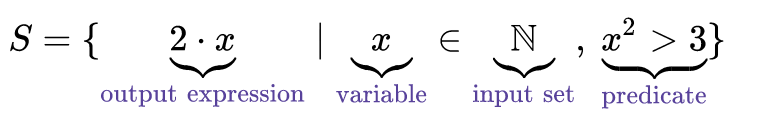
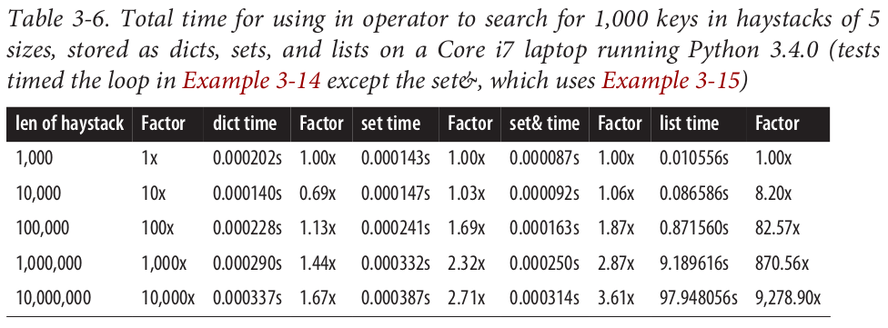
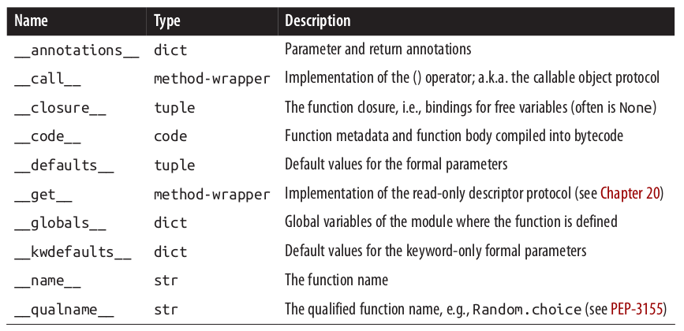

This file contains my personal notes of the excellent book *"Fluent Python", Ramaho (2015)*.


- [Chapter 2](#chapter-2-data-structures): **Data Structures.** Overview of data structures, list comprehension, generators, unpacking, sorting, binary search, arrays.
- [Chapter 3](#chapter-3-dictionaries-and-sets): **Dictionaries and Sets.** Comparison between Dictionaries, Sets, and Lists. Performance evaluation.
- [Chapter 4](#chapter-4-strings-versus-bytes): **Strings VS Bytes.** How to encode/decode string/bytes.
- [Chapter 5](#chapter-5-functions-as-first-class-objects): **Functions as first-class objects.** Functional programming, Lambda functions, callable operator, annotations.
- [Chapter 7](#chapter-7-function-decorators-and-closures): **Function Decorators and Closures.** Definition, stacked and parameterized decorators, local variables, closures.
- [Chapter 8](#chapter-8-object-references-mutability-and-recycling): **Object References, Mutability, and Recycling.** Copies and deep copies, garbage collector, parameters as references.
- [Chapter 9](#chapter-9-pythonic-objects): **Pythonic objects.** Object representations, hashable objects, class private instances, name mangling.
- [Chapter 10](#chapter-10-sequence-hacking-hashing-and-slicing): **Sequence hacking, hashing, and slicing.** Protocols, duck typing, reducing functions (reduce, map-reduce, zip).
- [Chapter 11](http://localhost:6419/python-tips/#chapter-11-interfaces-from-protocols-to-abcs): **Interfaces: From Protocols to ABCs.** Interfaces, defining and subclassing ABCs.


Chapter 2: Data Structures
===========================

Strings and Bytes
-----------------

In Python 3, strings and bytes cannot be combined.

```python
my_string = "abc"
my_byte = b"def"

print(my_string.encode() + my_byte) # it works, string->byte
print(my_string + my_byte.decode()) # it works, byte-> string
print(my_string + my_byte) # error, does not work

```

Iterate a list in reverse
-------------------------

Use the method `reversed(my_list)`. For instance:

```python
my_list=[i for i in range(10)]
for i in reversed(my_list):
    print(i)
```

chr() and ord()
----------------

The built-in function `chr()` turns the input number into a char whereas the function `ord()` does the opposite, turning a given character into its number.

```python
chr(97) # 'a'
ord("a") # 97
```

Print through repr
---------------

The `__repr__` special method is called by the repr built-in to get the string representation of the object for inspection. 

```python
class Vector:
    def __init__(self, x=0, y=0):
        self.x = x
        self.y = y
    def __repr__(self):
        return 'Vector(%r, %r)' % (self.x, self.y)
```

If we did not implement `__repr__` , vector instances would be shown in the console like `<Vector object at 0x10e100070>`. The string returned by `__repr__` should be unambiguous and, if possible, match the source code necessary to re-create the object being represented. That is why our chosen representation looks like calling the constructor of the class (e.g., Vector(3, 4) ).


List comprehension
------------------

The [list comprehension](https://en.wikipedia.org/wiki/List_comprehension) is a syntactic construct available in  Python for creating a list based on existing lists. It follows the form of the mathematical set-builder notation (set comprehension):

<p align="center">

</p>

This translates in the following Python syntax:

```
{expression(variable) for variable in input_set [predicate][, …]}
```

- expression (optional). An output expression producing members of the new set from members of the input set that satisfy the predicate expression.
- variable (required). Variable representing members of an input set.
- input_set (required). Represents the input set.
- predicate (optional). Expression acting as a filter on members of the input set.
- [, …]] (optional). Another nested comprehension. 

Here, a few examples of list comprehension:

```python
all = [x for x in range(10)] # [0, 1, 2, 3, 4, 5, 6, 7, 8, 9]
even = [x for x in range(10) if x%2==0] # [0, 2, 4, 6, 8]
square = [x**2 for x in range(10)] # [0, 1, 4, 9, 16, 25, 36, 49, 64, 81]
even_square = [x**2 for x in range(10) if x%2==0] # [0, 4, 16, 36, 64]
```

List comprehension can be used in more complex ways by nesting other comprehensions. For instance, if we have two lists of different sizes (first list of size N and second of size M) we can combine them to get all the pairs (size NxM):

```python
colors = ['black', 'white']
sizes = ['S', 'M', 'L']
tshirts = [(color, size) for color in colors for size in sizes]
print(tshirts)
#[('black', 'S'), ('black', 'M'),
#('white', 'M'), ('white', 'L')]
```

NOTE: Listcomps are a one-trick pony: they build lists. To fill up other sequence types (e.g. arrays, tuples) a **Generator Expression** is the way to go. The next section is a brief look at genexps in the context of building nonlist sequences.

Generator Expressions
---------------------

Genexps use the same syntax as listcomps, but are enclosed in parentheses rather than brackets:

```python
a = tuple(x for x in range(10))
print(a) # (0, 1, 2, 3, 4, 5, 6, 7, 8, 9)
```

Unpacking
----------

```python
lax_coordinates = (33.9425, -118.408056)
latitude, longitude = lax_coordinates # tuple unpacking
```

An elegant application of tuple unpacking is **swapping** the values of variables without using a temporary variable:

```python
b, a = a, b
```

**Using * to grab excess items.** Defining function parameters with *args to grab arbitrary excess arguments is a classic Python feature. In Python 3, this idea was extended to apply to parallel assignment as well:

```python
a, b, *rest = range(5)
print(a) # 0
print(b) # 1
print(rest) # [2, 3, 4]
```

In the context of parallel assignment, the * prefix can be applied to exactly one variable, but it can appear in any position:

```python
a, *rest, b = range(5)
print(a) # 0
print(rest) # [1, 2, 3]
print(b) # 4
```


Slicing
-------

**Why Slices and Range Exclude the Last Item.** The Pythonic convention of excluding the last item in slices and ranges works well with
the zero-based indexing used in Python, C, and many other languages. Some convenient features of the convention are:

- It's easy to see the length of a slice or range when only the stop position is given: `range(3)` and `my_list[:3]` both produce three items.
- It's easy to compute the length of a slice or range when start and stop are given: just subtract stop - start.
- It's easy to split a sequence in two parts at any index x , without overlapping: simply get `my_list[:x]` and `my_list[x:]`.


This is no secret, but worth repeating just in case: `s[a:b:c]` can be used to specify a stride or step `c`, causing the resulting slice to skip items. The stride can also be negative, returning items in reverse. Three examples make this clear:

```python
s = 'bicycle'
s[::3] # 'bye'
s[::-1] # 'elcycib'
s[::-2] # 'eccb'
```

Sorting
--------

Both list.sort and sorted take two optional, keyword-only arguments: 

- **reverse.** If True, the items are returned in descending order (i.e., by reversing the comparison of the items). Default is False.
- **key.** A one-argument function that will be applied to each item to produce its sorting key. For example, when sorting a list of strings, `key=str.lower`can be used to perform a case-insensitive sort, and `key=len` will sort the strings by character length. The default is the identity function (i.e., the items themselves are compared).

```python
fruits = ['grape', 'raspberry', 'apple', 'banana']
sorted(fruits) # ['apple', 'banana', 'grape', 'raspberry']
fruits # ['grape', 'raspberry', 'apple', 'banana']
sorted(fruits, reverse=True) #['raspberry', 'grape', 'banana', 'apple']
sorted(fruits, key=len) # ['grape', 'apple', 'banana', 'raspberry']
sorted(fruits, key=len, reverse=True) # ['raspberry', 'banana', 'grape', 'apple']
fruits # ['grape', 'raspberry', 'apple', 'banana']
fruits.sort()
fruits # ['apple', 'banana', 'grape', 'raspberry']
```

Using key lets us sort a mixed bag of numbers and number-like strings. You just need to decide whether you want to treat all items as integers or strings:

```python
l = [28, 14, '28', 5, '9', '1', 0, 6, '23', 19]
sorted(l, key=int) # [0, '1', 5, 6, '9', 14, 19, '23', 28, '28']
sorted(l, key=str) # [0, '1', 14, 19, '23', 28, '28', 5, 6, '9']
```

**Note:** the sorting algorithm used in `sorted` and `list.sort` is [Timsort](https://en.wikipedia.org/wiki/Timsort), an adaptive algorithm that switches from insertion sort to merge sort strategies, depending on how ordered the data is. This is efficient because real-world data tends to have runs of sorted items. Timsort was first deployed in CPython, in 2002. Since 2009, Timsort is also used to sort arrays in both standard Java and Android, a fact that became widely known when Oracle used some of the code related to Timsort as evidence of Google infringement of Sun’s intellectual property. Timsort was invented by Tim Peters, a Python core developer so prolific that he is believed to be an AI, the Timbot. You can read about that conspiracy theory in Python Humor.

Bisect: binary search
----------------------

The bisect module offers two main functions: bisect and insort. They use the binary search algorithm to quickly find and insert items in any sorted sequence. The call to `bisect(haystack, needle)` does a binary search for needle in haystack --which must be a sorted sequenc-- to locate the position where needle can be inserted while main‐taining haystack in ascending order. In other words, all items appearing up to that position are less than or equal to needle . You could use the result of `bisect(haystack,needle)` as the index argument to `haystack.insert(index, needle)`. However, using `insort` does both steps, and is faster.

The behavior of bisect can be fine-tuned in two ways:

- First, a pair of optional arguments, `lo` and `hi`, allow narrowing the region in the sequence to be searched when inserting. lo defaults to 0 and hi to the len() of the sequence.
- Second, bisect is actually an alias for `bisect_right`, and there is a sister function called `bisect_left`. Their difference is apparent only when the needle compares equal to an item in the list. The `bisect_right` returns an insertion point after the existing item, and the `bisect_left` returns the position of the existing item, so insertion would occur before

```python
import bisect
haystack = [1, 4, 5, 6, 8, 12, 15, 20, 21, 23, 23, 26, 29, 30]
needle = 22
position = bisect.bisect(haystack, needle) # equivalent to bisect.bisect_right(haystack, needle)
print(position) # 9
position = bisect.bisect_left(haystack, needle) 
print(position) # 9
```

An interesting application of bisect is to perform **table lookups** by numeric values. For example, to convert test scores to letter grades:

```python
def grade(score, breakpoints=[60, 70, 80, 90], grades='FDCBA'):
    i = bisect.bisect(breakpoints, score)
    return grades[i]

scores = [33, 99, 77, 70, 89, 90, 100]
scores_graded = [grade(score) for score in scores] 
print(scores_graded) # ['F', 'A', 'C', 'C', 'B', 'A', 'A']
```

**Inserting with bisect.insort().** Sorting is expensive, so once you have a sorted sequence, it's good to keep it that way. That is why bisect.insort was created. Calling `insort(seq, item)` inserts item into seq so as to keep seq in ascending order. Like bisect , insort takes optional `lo` and `hi` arguments to limit the search to a sub-sequence. There is also an `insort_left` variation that uses `bisect_left` to find insertion points.


Array
-----

Python programmers sometimes overuse the list type because it is so handy (I know I’ve done it). If you are handling lists of numbers, arrays are the way to go. The list type is flexible and easy to use, but depending on specific requirements, there are better options. For example, if you need to store 10 million floating-point values, an array is much more efficient, because an array does not actually hold full-fledged float objects, but only the packed bytes representing their machine values—just like an array in the C language.


```python
from array import array
from random import random
floats = array('d', (random() for i in range(10**7)))
floats[-1] # 0.07802343889111107
fp = open('floats.bin', 'wb')
floats.tofile(fp) # fast saving to file
fp.close()
floats2 = array('d')
fp = open('floats.bin', 'rb')
floats2.fromfile(fp, 10**7) # fast reading from file
fp.close()
floats2[-1] # 0.07802343889111107
floats2 == floats # True
```


Chapter 3: Dictionaries and Sets
=================================

The dict type is not only widely used in our programs but also a fundamental part of the Python implementation. Because of their crucial role, Python dicts are highly optimized. **Hash tables** are the engines behind Python’s high-performance dicts. All mapping types in the standard library use the basic dict in their implementation, so they share the limitation that the **keys must be hashable** (the values need not be hashable, only the keys).

**What is hashable?** Here is part of the definition of hashable from the Python Glossary: 

*"An object is hashable if it has a hash value which never changes during its lifetime (it needs a `__hash__()` method), and can be compared to other objects (it needs an `__eq__()` method). Hashable objects which compare equal must have the same hash value."*

The atomic immutable types ( str , bytes , numeric types) are all hashable. A tuple is hashable only if all its items are hashable.

```python
tt = (1, 2, (30, 40))
hash(tt) # hashabel: 8027212646858338501
tl = (1, 2, [30, 40])
hash(tl) # not hashable: error
```

Dictionary declaration
-------------

There are various ways a Dictionary cab be declared. Here, some examples:

```python
a = dict(one=1, two=2, three=3)
b = {'one': 1, 'two': 2, 'three': 3}
c = dict(zip(['one', 'two', 'three'], [1, 2, 3]))
d = dict([('two', 2), ('one', 1), ('three', 3)])
e = dict({'three': 3, 'one': 1, 'two': 2})
a == b == c == d == e # True
```


Dictionary Comprehensions
-------------------

Comprehension can be used with both dictionaries and sets. Here, an example:

```python
DIAL_CODES = [(86, 'China'),(91, 'India'),(1, 'United States'),
              (62, 'Indonesia'),(55, 'Brazil'),(92, 'Pakistan'),
              (880, 'Bangladesh'),(234, 'Nigeria'),(7, 'Russia'),
              (81, 'Japan'),]

country_code = {country: code for code, country in DIAL_CODES}

print(country_code)
#{'China': 86, 'India': 91, 'Bangladesh': 880, 'United States': 1,
#'Pakistan': 92, 'Japan': 81, 'Russia': 7, 'Brazil': 55, 'Nigeria':
#234, 'Indonesia': 62}
```

Search in a dictionary
-----------------------

A search like `k in my_dict.keys()` is **efficient** in Python 3 even for very large mappings because `dict.keys()` returns a view, which is similar to a set, and containment checks in sets are as fast as in dictionaries. Details are documented in the “Dictionary” view objects section of the documentation. In Python 2, `dict.keys()` returns a list, so our solution also works there, but it is not efficient for large dictionaries, because `k in my_list` must scan the list.


Sets
------

A set is a collection of unique objects. Set elements must be hashable. The set type is not hashable. Like dictionary they allow fast access to elements but they do not use a key-value mechanism. They can be considered perfect for membership checks, replacing those dictionaries where a dummy value was previously used. Sets can be declared this way:

```python
my_set={1,2,3,4}
print(my_set) # {1,2,3,4}
```

A basic use case is removing duplication:

```python
l = ['spam', 'spam', 'eggs', 'spam']
set(l) # {'eggs', 'spam'}
list(set(l)) # ['eggs', 'spam']
```

The set types implement the **essential set operations** as infix operators. Given two sets `a` and `b` , 

- `a | b` computes the union.
- `a & b` computes the intersection.
- `a - b` computes the difference (relative complement).
- `a ^ b` computes the symmetric difference (complement of the intersection `a & b`).
- `a < b` returns True if `a` is a subset of `b` (likewise `a > b` returns True if superset).

Smart use of set operations can reduce both the line count and the runtime of Python programs, at the same time making code easier to read and reason about—by removing loops and lots of conditional logic. For example, imagine you have a large set of email addresses (the haystack ) and a smaller set of addresses (the needles ) and you need to count how many needles occur in the haystack. Thanks to set intersection (the & operator) you can code that in a simple line:

```python
# needles and haystack are sets
found = len(needles & haystack) # first way
found = len(needles.intersection(haystack)) # second way
```

The notation for **set comprehension** can also be used with sets.


Comparing dict, set, and list
-----------------------------

A hash table is a sparse array (i.e., an array that always has empty cells). In standard data
structure texts, the cells in a hash table are often called “buckets.” In a dict hash table,
there is a bucket for each item, and it contains two fields: a reference to the key and a
reference to the value of the item.

**Dictionary.** To fetch the value at `my_dict[search_key]`, Python calls `hash(search_key)` to obtain the hash value of `search_key` and uses the least significant bits of that number as an offset to look up a bucket in the hash table (the number of bits used depends on the current size of the table). If the found bucket is empty, `KeyError` is raised. Otherwise, the found bucket has an item (a `found_key:found_value` pair) and then Python checks whether `search_key == found_key`. If they match, that was the item sought: `found_value` is returned. If `search_key` and `found_key` do not match, this is a hash collision. In order to resolve the collision, the algorithm then takes different bits in the hash, massages them in a particular way, and uses the result as an offset to look up a different bucket. Python may determine that the hash table is too crowded and rebuild it to a new location with more room. As the hash table grows, so does the number of hash bits used as bucket offsets, and this keeps the rate of collisions low. This implementation may seem like a lot of work, but even with millions of items in a dict, many searches happen with no collisions, and the average number of collisions per search is between one and two. Under normal usage, even the unluckiest keys can be found after a handful of collisions are resolved.

**Set.** Similarly to dictionaries, set types are also implemented with a hash table, except that each bucket holds only a reference to the element (as if it were a key in a dict, but without a value to go with it). In fact, before set was added to the language, we often used dictionaries with dummy values just to perform fast membership tests on the keys.

**List.** They contain references to elements. However, differently from dictionaries and sets they do not use a hash table for mapping. It follows that retrieving a particular element from a list by using `in` has cost dependent from the length of the list (it necessary to iterate all the elements).

<p align="center">

</p>


Chapter 4: Strings versus Bytes
=============================

The concept of *string* is simple enough: a string is a sequence of characters. The problem lies in the definition of *character*. In 2015, the best definition of *character* we have is a Unicode character. Accordingly, the items you get out of a Python 3 `str` are Unicode characters, just like the items of a unicode object in Python 2, and not the raw bytes you get from a Python 2 `str`.

**Unicode standard.** It explicitly separates the identity of characters from specific byte representations. The identity of a character is a number from 0 to 1,114,111 (base 10), shown in the Unicode standard as 4 to 6 hexadecimal digits with a `U+` prefix. For example, the code point for the letter `A` is `U+0041`.

**Encoding.** An encoding is an algorithm that converts code points to byte sequences and vice versa. The actual bytes that represent a character depend on the encoding in use. The code point for A (`U+0041`) is encoded as the single byte `\x41` in the UTF-8 encoding, or as the bytes `\x41\x00` in UTF-16LE encoding. As another example, the Euro sign (`U+20AC`) becomes three bytes in UTF-8 (`\xe2\x82\xac`), but in UTF-16LE it is encoded as two bytes (`\xac\x20`). Converting from code points to bytes is encoding; converting from bytes to code points is decoding. Since byte sequences can be cryptic for humans, while Unicode `str` objects are "human" readable, it makes sense that we `decode` bytes to strings to get human-readable text, and we `encode` strings to bytes for storage or transmission.

```python
s = 'café'
len(s) # 4
b = s.encode('utf8') # b'caf\xc3\xa9'
# bytes literals start with a b prefix
# bytes b has five bytes
# “é” encoded as two bytes in UTF-8
len(b) # 5
b.decode('utf8') # 'café'
```

You see `b'caf\xc3\xa9'` with the first three bytes `b'caf'` in the printable ASCII range, the last two not. Three different displays are used, depending on each byte value:

1. For bytes in the printable ASCII range, from `space` to `~`, the ASCII character itself is used.
2. For bytes corresponding to `tab`, `newline`, `carriage return`, and `\` , the escape sequences `\t` , `\n` , `\r` , and `\\` are used.
3. For every other byte value, a hexadecimal escape sequence is used (e.g., `\x00` is the null byte).


Bytes
------

We can build `bytes` from a `str`, given an encoding. Each item of `bytes` is an integer in range(256). Slices of bytes are also bytes, even slices of a single byte. There is no literal syntax for `bytearray`: they are shown as `bytearray()` with a bytes literal as argument. A slice of `bytearray` is also a `bytearray`.

```python
cafe = bytes('café', encoding='utf_8') # b'caf\xc3\xa9'
cafe[0] # 99
cafe[:1] # b'c'
cafe_arr = bytearray(cafe) # bytearray(b'caf\xc3\xa9')
cafe_arr[-1:] # bytearray(b'\xa9')
```

The fact that `my_bytes[0]` retrieves an int but `my_bytes[:1]` returns a bytes object of length 1 should not be surprising. The only sequence type where `s[0] == s[:1]` is the `str` type. Although practical, this behavior of `str` is exceptional. For every other sequence, `s[i]` returns one item, and `s[i:i+1]` returns a sequence of the same type with the `s[1]` item inside it.


You can use familiar string methods like `endswith`, `replace`, `strip`, `translate`, `upper` , and dozens of others with binary sequences. The regular expression functions in the `re` module also work on binary sequences (if the regex is compiled from a binary sequence instead of a `str`).

Basic Encoders/Decoders
-----------------------

The Python distribution bundles more than 100 codecs (encoder/decoder) for text to byte conversion and vice versa. Each codec has a name, like 'utf_8' , and often aliases, such as 'utf8' , 'utf-8' , and 'U8' , which you can use as the encoding argument. The following are a representative set of common encodings:

- latin1 a.k.a. iso8859_1. Important because it is the basis for other encodings, such as cp1252 and Unicode itself (note how the latin1 byte values appear in the cp1252 bytes and even in the code points).
- cp1252. A latin1 superset by Microsoft, adding useful symbols like curly quotes and the € (euro); some Windows apps call it “ANSI,” but it was never a real ANSI standard.
- cp437. The original character set of the IBM PC, with box drawing characters. Incompatible with latin1 , which appeared later.
- gb2312. Legacy standard to encode the simplified Chinese ideographs used in mainland China; one of several widely deployed multibyte encodings for Asian languages.
- utf-8. The most common 8-bit encoding on the Web, by far; 3 backward-compatible with ASCII (pure ASCII text is valid UTF-8).
- utf-16le. One form of the UTF-16 16-bit encoding scheme; all UTF-16 encodings support code points beyond `U+FFFF` through escape sequences called "surrogate pairs".


```python
for codec in ['latin_1', 'utf_8', 'utf_16']:
    print(codec, 'El Niño'.encode(codec), sep='\t')
# b'El Ni\xf1o'
# b'El Ni\xc3\xb1o'
# b'\xff\xfeE\x00l\x00 \x00N\x00i\x00\xf1\x00o\x00'
```

WARNING: code that has to run on multiple machines or on multiple occasions should never depend on encoding defaults. Always pass an explicit `encoding` argument when opening text files `fp = open('cafe.txt', 'w', encoding='utf_8')`, because the default may change from one machine to the next, or from one day to the next. On GNU/Linux and OSX all of these encodings are set to UTF-8 by default, and have been for several years, so I/O handles all Unicode characters. On Windows, not only are different encodings used in the same system, but they are usually codepages like 'cp850' or 'cp1252' that support only ASCII with 127 additional characters that are not the same from one encoding to the other. Therefore, Windows users are far more likely to face encoding errors unless they are extra careful.


Coping with Unicode Encode and Decode Errors
-----------------------------


**Encode errors**

Most non-UTF codecs handle only a small subset of the Unicode characters. When converting text to bytes, if a character is not defined in the target encoding, UnicodeEncodeError will be raised, unless special handling is provided. Not every byte holds a valid ASCII character, and not every byte sequence is valid UTF-8 or UTF-16; therefore, when you assume one of these encodings while converting a binary sequence to text, you will get a `UnicodeDecodeError` if unexpected bytes are found. 


The parameter `errors` can be used for handling **encoding errors**:

- **ignore.** The `errors='ignore'` handler silently skips characters that cannot be encoded (usually a bad idea).
- **replace.** The `errors='replace'` substitutes unencodable characters with `'?'` (data is lost but users will know).
- **xmlcharrefreplace.** The `errors='xmlcharrefreplace'` replaces unencodable characters with an XML entity.


```python
city = 'São Paulo'
city.encode('utf_8') # b'S\xc3\xa3o Paulo'
city.encode('cp437', errors='ignore') # b'So Paulo'
city.encode('cp437', errors='replace') # b'S?o Paulo'
city.encode('cp437', errors='xmlcharrefreplace') # b'S&#227;o Paulo'
city.encode('cp437') # UnicodeEncodeError: 'charmap' codec can't encode character '\xe3' [...]
```

**Decode errors**

Not every byte holds a valid ASCII character, and not every byte sequence is valid UTF-8 or UTF-16; therefore, when you assume one of these encodings while converting a binary sequence to text, you will get a `UnicodeDecodeError` if unexpected bytes are found. Be careful, many 8-bit encodings like 'cp1252' , 'iso8859_1' , and 'koi8_r' are able to decode any stream of bytes without errors. If your program assumes the wrong 8-bit encoding, it will silently decode garbage.

```
octets = b'Montr\xe9al'
octets.decode('cp1252') # 'Montréal'
octets.decode('iso8859_7') # 'Montrιal'
octets.decode('koi8_r') # 'MontrИal'
octets.decode('utf_8') # UnicodeDecodeError: 'utf-8' codec can't decode byte 0xe9 [...]
octets.decode('utf_8', errors='replace') # 'Montr�al'
```

Using `replace` error handling, the `\xe9` is replaced by `�` (code point `U+FFFD`), the official Unicode REPLACEMENT CHARACTER intended to represent unknown characters.

Errors when loading a python file
---------------------------------

UTF-8 is the default source encoding for Python 3, just as ASCII was the default for Python 2 (starting with 2.5). If you load a .py module containing non-UTF-8 data and no encoding declaration, you get a message like this:

```
SyntaxError: Non-UTF-8 code starting with '\xe1' in file ola.py on line
1, but no encoding declared; see http://python.org/dev/peps/pep-0263/
for details
```

Because UTF-8 is widely deployed in GNU/Linux and OSX systems, a likely scenario is opening a `.py` file created on Windows with cp1252 . To fix this problem, add a magic coding comment at the top of the file:

```python
# coding: cp1252
print('Olá, Mundo!')
```

Now that Python 3 source code is no longer limited to ASCII and defaults to the excellent UTF-8 encoding, the best “fix” for source code in legacy encodings like 'cp1252' is to convert them to UTF-8 and not bother with the coding comments. Python 3 allows non-ASCII identifiers in source code:

```python
ação = 'PBR' # ação = stock
ε = 10**-6 # ε = epsilon
```

However, some people dislike the idea. The most common argument to stick with ASCII identifiers is to make it easy for everyone to read and edit code.


Chapter 5: Functions as first-class objects
========================================

In computer science, [functional programming](https://en.wikipedia.org/wiki/Functional_programming) is a programming paradigm where programs are constructed by applying and composing functions. It is a declarative programming paradigm in which function definitions are trees of expressions that each return a value, rather than a sequence of imperative statements which change the state of the program. In functional programming, functions are treated as first-class citizens, meaning that they can be bound to names (including local identifiers), passed as arguments, and returned from other functions, just as any other data type. This allows programs to be written in a declarative and composable style, where small functions are combined in a modular manner. 

Functions in Python
--------------------

Functions in Python are first-class objects. Programming language theorists define a “first-class object” as a program entity that can be:

- Created at runtime
- Assigned to a variable or element in a data structure
- Passed as an argument to a function
- Returned as the result of a function

```python
def factorial(n):
    ''' Documentation of the factorial function.

    It returns n!.
    '''
    return 1 if n<2 else n*factorial(n-1) # -> iterative method
```

Note that it is possible to access the documentaiton of the method by typing `factorial.__doc__` which prints the information about the method. We can also pass factorial as an argument to map . The **map function** returns an iterable where each item is the result of the application of the first argument (a function) to succesive elements of the second argument (an iterable), range(10) in this example.

```python
list(map(factorial, range(11)))
# [1, 1, 2, 6, 24, 120, 720, 5040, 40320, 362880, 3628800]
```

Higher-Order Functions
----------------------

A function that takes a function as argument or returns a function as the result is a higher-order function. One example is `map`, another is the builtin function `sorted`. For instance, we can combine `map` with the previously created method `factorial` and give the result as input to `sorted`:

```python
sorted(map(factorial, range(5)))
```

We can create a custom function to reverse the number and chain it with `map` and `sorted`. We can also pass the function as the `key` argument to the `sorted` method (any one-argument function can be used as the key). In this case the method will not change the elements of the input list but will use the method as sorting criterium:

```python
def reverse(number):
    string = str(number)
    string = string[::-1]
    return int(string)

sorted(map(reverse, range(1000,1010)))
# [1, 1001, 2001, 3001, 4001, 5001, 6001, 7001, 8001, 9001]
sorted([1234, 5678, 4321, 8765])
# [1234, 4321, 5678, 8765]
sorted([1234, 5678, 4321, 8765], key=reverse)
# [4321, 1234, 8765, 5678] elements are not changed only ordered based on 'reverse'
```

Replacements for map, filter, and reduce
----------------------------------------

Starting with Python 3.0, `reduce` is not a built-in. The `map` and `filter` functions are still built-in in Python 3, but since the introduction of list comprehensions and generator expressions, they are not as important since we can replace a verbose map or filter via a simpler list comprehension. The following two lines of code do the same thing:


```python
list(map(factorial, range(6)))
[factorial(n) for n in range(6)]
```

Similarly, for the filter function:

```python
list(map(factorial, filter(lambda n: n % 2, range(6))))
[factorial(n) for n in range(6) if n % 2]
```


Anonymous Functions
-------------------

The **lambda** keyword creates an anonymous function within a Python expression. However, the simple syntax of Python limits the body of lambda functions to be pure expressions. In other words, the body of a lambda cannot make assignments or use any other Python statement such as while, try, etc. The best use of anonymous functions is in the context of an argument list. For instance, we can sort an array of strings in reverse order writing:


```python
fruits = ['strawberry', 'fig', 'apple', 'cherry', 'raspberry', 'banana']
sorted(fruits)
# ['apple', 'banana', 'cherry', 'fig', 'raspberry', 'strawberry']
sorted(fruits, key=lambda word: word[::-1])
# ['banana', 'apple', 'fig', 'raspberry', 'strawberry', 'cherry']
```

WARNING: Outside the limited context of arguments to higher-order functions, anonymous functions are rarely useful in Python. The syntactic restrictions tend to make nontrivial lambdas either unreadable or unworkable.

Callable operator `()`
----------------------

The callable operator `()` is used by a variety of entities in Python. Given the variety of existing callable types in Python, the safest way to determine whether an object is callable is to use the `callable()` built-in. Here is given an overview of the various callable types:

- User-defined functions. Created with def statements or lambda expressions.
- Built-in functions. A function implemented in C (for CPython), like len or time.strftime .
- Built-in methods. Methods implemented in C, like `dict.get` .
- Methods. Functions defined in the body of a class.
- Classes. When invoked, a class runs its `__new__` method to create an instance, then `__init__` to initialize it, and finally the instance is returned to the caller. Because there is no new operator in Python, calling a class is like calling a function. (Usually calling a class creates an instance of the same class, but other behaviors are possible by overriding `__new__`.
- Class instances. If a class defines a `__call__` method, then its instances may be invoked as functions.
- Generator functions. Functions or methods that use the `yield` keyword. When called, generator functions return a generator object.


User-Defined Callable Types
----------------------------

Not only are Python functions real objects, but arbitrary Python objects may also be made to behave like functions. Implementing a `__call__` instance method is all it takes.

```python
import random
class BingoCage:
    def __init__(self, items):
        self._items = list(items)
        random.shuffle(self._items)
    def pick(self):
        try:
            return self._items.pop()
        except IndexError:
            raise LookupError('pick from empty BingoCage')
    def __call__(self):
        return self.pick()

bingo = BingoCage(range(3))
bingo.pick() # 1
bingo() # 0
callable(bingo) # True
```

Using the method `__call__` the class `BingoCage` beomes callable, meaning that one can use the shorthand `bingo()` in place of `bingo.pick()`

Function introspection
----------------------

In computer programming, introspection is the ability to determine the type of an object at runtime. It is one of Python’s strengths. Everything in Python is an object and we can examine those objects. Python ships with a few built-in functions and modules to help us.

A full list of attributes for the function object can be retrieved using `dir()` as follows:

```python
def dummy(): 
    pass

dir(dummy)
# ['__annotations__', '__call__', '__class__', '__closure__', '__code__',
# '__defaults__', '__delattr__', '__dict__', '__dir__', '__doc__', '__eq__',
# '__format__', '__ge__', '__get__', '__getattribute__', '__globals__',
# '__gt__', '__hash__', '__init__', '__kwdefaults__', '__le__', '__lt__',
# '__module__', '__name__', '__ne__', '__new__', '__qualname__', '__reduce__',
# '__reduce_ex__', '__repr__', '__setattr__', '__sizeof__', '__str__',
# '__subclasshook__']
```

The `__dict__` attribute can be used to store user-attributes assigned to it. This is useful as a primitive form of annotation. Assigning arbitrary attributes to functions is not a very common practice in general.

Only a subset of these attributes is **only** associated to functions:

```python
# ['__annotations__', '__call__', '__closure__', '__code__', '__defaults__',
# '__get__', '__globals__', '__kwdefaults__', '__name__', '__qualname__']
```


<p align="center">

</p>


Parameter handling
------------------

One of the best features of Python functions is the extremely flexible parameter handling mechanism, enhanced with keyword-only arguments in Python 3. Closely related are the use of `*` and `**` to explode iterables and mappings into separate arguments when we call a function.

```python
my_method(first_param, *to_tuple_params, third_param=None, **attrs):
    pass
```

Any number of arguments after the first are captured by `*to_tuple_params` as a tuple. The `third_param` parameter can only be passed as a keyword argument. Keyword arguments not explicitly named in the tag signature are captured by `**attrs` as a dict .

Keyword-only arguments are a new feature in Python 3. In the example, the `third_param` parameter can only be given as a keyword argument (it will never capture unnamed positional arguments). To specify keyword-only arguments when defining a function, name them after the argument prefixed with `*`. If you don’t want to support variable positional arguments but still want keyword-only arguments, put a `*` by itself in the signature, like this:

```python
def f(a, *, b):
    return a, b

f(1, b=2) # (1, 2)
```

Keyword-only arguments do not need to have a default value: they can be mandatory, like `b` in the previous example.


Function Annotations
---------------------

Python 3 provides syntax to attach metadata to the parameters of a function declaration and its return value. Each argument in the function declaration may have an annotation expression preceded by `:`. If there is a default value, the annotation goes between the argument name and the `=` sign. To annotate the return value, add `->` and another expression between the `)` and the `:` at the tail of the function declaration. The expressions may be of any type. The most common types used in annotations are classes, like `str` or `int` , or strings. Consider this example:

```python
def clip(text:str, max_len:'int > 0'=80) -> str:
    """Return text clipped at the last space before or after max_len
    """
    pass
```

Note how the annotation of the first parameter is `str` showing to the user that it should be a string, the annotation of the second parameter is `'int > 0'` (followed by a default value `80`). The returns value is marked with `->`, in the example it shows to the user that the returned value should be a `str` objects.

IMPORTANT: No processing is done with the annotations. They are merely stored in the `__annotations__` attribute of the function, a dict. No checks, enforcement, validation, or any other action is performed. In other words, annotations have no meaning to the Python interpreter. They are just metadata.


Chapter 7: Function Decorators and Closures
========================================

Function decorators let us *“mark”* functions in the source code to enhance their behavior in some way. This is powerful stuff, but mastering it requires understanding closures.

Decorators
----------

A decorator is a *callable* that takes another function as argument (the decorated function). The decorator may perform some processing with the decorated function, and returns it or replaces it with another function or callable object.
Assuming an existing decorator named decorate , this code:

```python
@decorate
def target():
    print('running target()')
```

Has the same effect as writing this:

```python
def target():
    print('running target()')
    target = decorate(target)
```

The end result is the same: at the end of either of these snippets, the `target` name does not necessarily refer to the original target function, but to whatever function is returned by `decorate(target)`. Strictly speaking, decorators are just syntactic sugar. You can always simply call a decorator like any regular callable, passing another function. Sometimes that is actually convenient, especially when doing metaprogramming (changing program behavior at runtime). Here another example:


```python
import time

def clock(func):
    def clocked(*args): #
        start = time.time()
        result = func(*args) #
        elapsed = time.time() - start
        print('[%0.8fs] -> %r' % (elapsed, result))
        return result
    return clocked

@clock
def factorial(n):
    return 1 if n < 2 else n*factorial(n-1) # -> iterative
    
# Calling factorial(8) actually does this:
#factorial = clock(factorial)
```

To summarize: the first crucial fact about decorators is that they have the power to replace the decorated function with a different one. The second crucial fact is that they are executed immediately when a module is loaded.

Consider this example:

```python
def deco(func):
    """deco() returns its inner function object
    """
    def inner():
        print('running inner()')
    return inner

@deco
def target():
    """target() is decorated by deco
    """
    print('running target()')

# Invoking the decorated target actually runs inner()
target() # 'running inner()'
# target is a now a reference to inner
target # <function deco.<locals>.inner at 0x10063b598>
```

Here is a more concrete example. Let's suppose we have a certain number of promotions in our e-commerce. Each promotion is a separate function. We want a special function called `best_promotion()` to check all the available promotion functions and return the best one for a given user. One way to do this would be to store all the promotions in a list `promos` and then pass this list to `best_promotion()`. However, this strategy would be problematic if at some point a new promotion is added and we forget to add it to the list. A different way to solve the issue is by using decorators to automatically fill the list:

```python
promos = []

def promotion(promo_func):
    promos.append(promo_func)
    return promo_func

@promotion
def fidelity(order):
    """5% discount
    """
    return 5

@promotion
def bulk_item(order):
    """10% discount
    """
    return 10

@promotion
def large_order(order):
    """7% discount
    """
    return 7

def best_promo(order):
    """Select best discount available
    """
    return max(promo(order) for promo in promos)
```

When the module is loaded, and each single promotion function is allocated, the decorator `@promotion` will invoke the associated function `promotion()` passing the single promotion as input. Then the `promotion()` function will populate the list `promos`. The advantages of this approach are many. The `@promotion` decorator highlights the purpose of the decorated function, and also makes it easy to temporarily disable a promotion: just comment out the decorator. Promotional discount strategies may be defined in other modules, anywhere in the system, as long as the `@promotion` decorator is applied to them.


**Stacked decorators.** When two decorators `@d1` and `@d2` are applied to a function `f` in that order, the result is the same as `f = d1(d2(f))`.

**Parameterized Decorators.** This is a bit hacky (see the book for the code). When parsing a decorator in source code, Python takes the decorated function and passes it as the first argument to the decorator function. So how do you make a decorator accept other arguments? The answer is: make a decorator factory that takes those arguments and returns a decorator, which is then applied to the function to be decorated.

Closures
---------

**Local variables**

To understand closures first we need to give a look at how local variables are allocated in Python. Consider this example:

```python
b = 6

def f2(a):
    print(a)
    print(b)
    b = 9
    
f2(3)
# print(a) -> 3
# print(b) -> UnboundLocalError: local variable 'b' referenced before assignment
```

This snippet generates an error. It may seems strange at first, because functions can access variables that have been declared outside their body, like `b=6` in this example. However, when Python compile this code it will see that `b` is present inside the body of `f2()` and by design this means that the variable is local. Note that this is a design choice. The advantage is to avoid overwriting a global variable by mistake inside a function. In other words, when we create a new function we do not have to worry if the variable names we are using internally already exist somewhere. Global variable can be read inside a function but not overwritten.

Note that using the keyword `global` it is possible to avoid this behaviour and directly act on the global variable `b` as follows:

```python
b = 6

def f2(a):
    print(a)
    global b
    print(b)
    b = 9
    
f2(3)
# print(a) -> 3
# print(b) -> 6
b
# 9
```

In the example `global b` is used before any attempt to access `b`. This tells the function that the variable `b` inside the scope is the global one. It follows that every time we modify `b` inside the function we are actually modifying the global `b`.


**Closures**

A closure is a function with an extended scope that encompasses nonglobal variables referenced in the body of the function but not defined there. It does not matter whether the function is anonymous or not; what matters is that it can access nonglobal variables that are defined outside of its body. To summarize: a closure is a function that retains the bindings of the free variables that exist when the function is defined, so that they can be used later when the function is invoked and the defining scope is no longer available. Note that the only situation in which a function may need to deal with external variables that are nonglobal is when it is nested in another function.

Consider an `avg` function to compute the mean of an ever-increasing series of values. For example, the average closing price of a commodity over its entire history. Every day a new price is added, and the average is computed taking into account all prices so far. Starting with a clean slate, this is how avg could be used:

```python
avg(10)
# 10.0
avg(11)
# 10.5
avg(12)
# 11.0
```

Where does `avg` come from, and where does it keep the history of previous values? 

The **trivial solution** would be to use a `__call__` method inside a class to make the object callable. As explained in [Chapter 5](#chapter-5-functions-as-first-class-objects) this makes a new instance of the `Average()` class callable. Let's see:

```python
class Averager():
    def __init__(self):
        self.series = []
    def __call__(self, new_value):
        self.series.append(new_value)
        total = sum(self.series)
        return total/len(self.series)
        
avg = Averager()
avg(10)
# 10.0
 avg(11)
# 10.5
avg(12)
# 11.0
```

The **closure solution** to the same problem is slightly different. 


```python
def make_averager():
    series = []
    
    def averager(new_value):
        series.append(new_value)
        total = sum(series)
        return total/len(series)
    return averager

avg = make_averager()
avg(10)
# 10.0
 avg(11)
# 10.5
avg(12)
# 11.0
```

It’s obvious where the avg of the `Averager()` class keeps the history: the `self.series` instance attribute. Where does the `avg` function in the second example find the series? Note that `series` is a local variable of `make_averager` because the initialization `series = []` happens in the body of that function. But when `avg(10)` is called, `make_averager` has already returned, and its local scope is long gone. Within `averager`, `series` is a **free variable**. This is a technical term meaning a variable that is not bound in the local scope.

In Python the closure free variables are stored in `__closure__` with each item in `avg.__closure__` corresponding to a name in `avg.__code__.co_freevars`. These items are cells, and they have an attribute called `cell_contents` where the actual value can be found.

```python
avg.__code__.co_freevars 
# ('series',)
avg.__closure__
# (<cell at 0x107a44f78: list object at 0x107a91a48>,)
avg.__closure__[0].cell_contents
# [10, 11, 12]
```


Chapter 8: Object References, Mutability, and Recycling
========================================

Difference between `==` and `is`
--------------------------------

There is a difference between `==` and `is` in Python. The `==` operator compares the values of objects (the data they hold), while `is` compares their identities. We often care about values and not identities, so `==` appears more frequently than `is` in Python code.

Variables in Python are sort of labels and not boxes. Consider an example where we create an object dictionary and assign to it two different labels `alex` and `charles`:

```python
alex = {'name': 'Charles L. Dodgson', 'born': 1832, 'balance': 950}
charles = alex

alex == charles # True
alex is charles # True
```

Note that both last two lines evaluate to `True`. The objects compare equal when using `==`, because of the `__eq__` implementation in the dict class. The `is` operator is faster than `==`, because it cannot be overloaded. In other words, `a == b` is syntactic sugar for `a.__eq__(b)`. The snippet above is an examples of **aliases**, since `charles` and `alex` are **alias**. Let's consider now a different example where we create a separate object for `charles` but with the same content of `alex`:

```python
alex = {'name': 'Charles L. Dodgson', 'born': 1832, 'balance': 950}
charles = {'name': 'Charles L. Dodgson', 'born': 1832, 'balance': 950}

alex == charles # True
alex is charles # False
```

The comparison `alex == charles` still evaluates to `True` since the content of the objects is the same. However, the last line `alex is charles` now evaluate to False, since `alex` and `charles` are two different objects.


Mutability
----------

The concept of mutability can be tricky sometimes. Consider **tuples**. Tuples, like most Python collections—lists (dicts, sets, etc.) hold references to objects. If the referenced items are mutable, they may change even if the tuple itself does not. In other words, the immutability of tuples really refers to the physical contents of the tuple data structure (i.e., the references it holds), and does not extend to the referenced objects. Here an example:

```python
t1 = (1, 2, [30, 40])
id(t1[-1])
# 4302515784
t1[-1].append(99) # (1, 2, [30, 40, 99])
id(t1[-1])
# 4302515784
```

The reference to the list inside the tuple did not change, but the content of the list itself changed. This is because the tuple is keeping references to objects and those references do not change.


Copies are shallow by default
-----------------------------

The easiest way to copy a list (or most built-in mutable collections) is to use the built-in constructor for the type itself. For example:

```python
l1 = [3, [55, 44], (7, 8, 9)]
l2 = list(l1) # creates a copy of l1
l2 == l1
# True
l2 is l1
# False
```

In this example the copies are equal, but refer to two different objects. For lists and other mutable sequences, the shortcut `l2 = l1[:]` also makes a copy.

IMPORTANT: However, using the constructor `list()` or `[:]` produces a **shallow copy** (i.e., the outermost container is duplicated, but the copy is filled with references to the same items held by the original container). This saves memory and causes no problems if all the items are immutable. But if there are mutable items (e.g. list of lists), this may lead to unpleasant surprises. Consider this example:


```python
l1 = [3, [66, 55, 44], (7, 8, 9)]
l2 = list(l1) # shallow copy

l1.append(100) # appending 100 to l1 has no effect on l2
l1[1].remove(55) # removing 55 from l1[1] affects l2
print('l1:', l1)
# l1: [3, [66, 44], (7, 8, 9), 100]
print('l2:', l2)
# l2: [3, [66, 44], (7, 8, 9)]

l2[1] += [33, 22] # += changes the list in place (affects l1)
l2[2] += (10, 11) # += on a tuple creates a new tuple (no effect on l1)
print('l1:', l1)
# l1: [3, [66, 44, 33, 22], (7, 8, 9), 100]
print('l2:', l2)
# l2: [3, [66, 44, 33, 22], (7, 8, 9, 10, 11)]
```

Deep copies
------------

The `copy` module provides the `deepcopy` and `copy` functions that return deep and shallow copies of arbitrary objects. Note that making deep copies is not a simple matter in the general case. Objects may have cyclic references that would cause a naïve algorithm to enter an infinite loop. The `deepcopy` function remembers the objects already copied to handle cyclic references
gracefully. Also, a deep copy may be too deep in some cases. For example, objects may refer to external resources or singletons that should not be copied. You can control the behavior of both copy and deepcopy by implementing the `__copy__()` and `__deepcopy__()` special methods. To illustrate the use of `copy()` and `deepcopy()` consider this example:

```python
class Bus:
    def __init__(self, passengers=None):
        if passengers is None: self.passengers = []
        else: self.passengers = list(passengers)
    def pick(self, name):
        self.passengers.append(name)
    def drop(self, name):
        self.passengers.remove(name)
        
import copy
bus1 = Bus(['Alice', 'Bill', 'Claire', 'David'])
bus2 = copy.copy(bus1)
bus3 = copy.deepcopy(bus1)
id(bus1), id(bus2), id(bus3)
# (4301498296, 4301499416, 4301499752)

bus1.drop('Bill')
bus2.passengers # ['Alice', 'Claire', 'David']
id(bus1.passengers), id(bus2.passengers), id(bus3.passengers)
# (4302658568, 4302658568, 4302657800)
bus3.passengers # ['Alice', 'Bill', 'Claire', 'David']
```


Function parameters are references
----------------------------------

The only mode of parameter passing in Python is **call by sharing**. Call by sharing means that each formal parameter of the function gets a copy of each reference in the arguments. In other words, the parameters inside the function become aliases of the actual arguments. The result of this scheme is that a function may change any mutable object passed as a parameter, but it cannot change the identity of those objects (i.e., it cannot altogether replace an object with another). Consider this example:

```python
def f(a, b):
    a += b
    return a

# Numbers are not changed
x = 1
y = 2
f(x, y) # 3
x, y # (1, 2)

# Lists are changed
# += changes the list in-place
a = [1, 2]
b = [3, 4]
f(a, b) # [1, 2, 3, 4]
a, b # ([1, 2, 3, 4], [3, 4])

# Tuples are not changed
# += create a new tuple
t = (10, 20)
u = (30, 40)
f(t, u) # (10, 20, 30, 40)
t, u # ((10, 20), (30, 40))
```

Why you should never have mutables as default parameters
--------------------------------------------------------

In the example of the bus we wrote `def __init__(self, passengers=None)` initializing the `passengers` list to `None`. Behind this there is a very important reason. You may feel smart, and directly initialize the list to an empty list like `def __init__(self, passengers=[])`. However, this last solution can create big troubles. Consider this example

```python
class HauntedBus:
    def __init__(self, passengers=[]):
        self.passengers = passengers
    def pick(self, name):
        self.passengers.append(name)
    def drop(self, name):
        self.passengers.remove(name)

bus1 = HauntedBus(['Alice', 'Bill']) # start full, list is passed, no problems
bus1.passengers # ['Alice', 'Bill']
bus1.pick('Charlie')
bus1.drop('Alice')
bus1.passengers # ['Bill', 'Charlie']

bus2 = HauntedBus() # start empty, passengers==[], problematic
bus2.pick('Carrie')
bus2.passengers # ['Carrie']

bus3 = HauntedBus() # start empty and inherit passengers from bus2
bus3.passengers # ['Carrie']
bus3.pick('Dave')

bus2.passengers # ['Carrie', 'Dave']
bus2.passengers is bus3.passengers
# True
bus1.passengers # ['Bill', 'Charlie']
```

The problem is that `HauntedBus` instances that don’t get an initial passenger list end up sharing the same passenger list among themselves! This can be solved by initializing to `None` and assigning a new list inside `__init__`, as we did previously.

Garbage collection and `del`
-----------------------------

The `del` statement deletes names, not objects. An object may be garbage collected as result of a `del` command, but only if the variable deleted holds the last reference to the object, or if the object becomes unreachable. Rebinding a variable may also cause the number of references to an object to reach zero, causing its destruction. There is a `__del__` special method, but it does not cause the disposal of the instance, and should not be called by your code. The `__del__` is invoked by the Python interpreter when the instance is about to be destroyed to give it a chance to release external resources. You will seldom need to implement `__del__` in your own code, yet some Python beginners spend time coding it for no good reason. In CPython, the primary algorithm for garbage collection is reference counting. Essentially, each object keeps count of how many references point to it. As soon as that `refcount` reaches zero, the object is immediately destroyed: CPython calls the `__del__` method on the object (if defined) and then frees the memory allocated to the object.

Weak References
---------------

The presence of references is what keeps an object alive in memory. When the reference count of an object reaches zero, the garbage collector disposes of it. But sometimes it is useful to have a reference to an object that does not keep it around longer than necessary. A common use case is a cache. Weak references to an object do not increase its reference count. The object that is the target of a reference is called the referent. Therefore, we say that a weak reference does not prevent the referent from being garbage collected. Weak references are useful in caching applications because you don’t want the cached objects to be kept alive just because they are referenced by the cache. Not every Python object may be the target, or referent, of a weak reference. Basic list and dict instances may not be referents, but a plain subclass of either can solve this problem easily


Chapter 9: Pythonic objects
============================

Object Representations
-----------------------

Every object-oriented language has at least one standard way of getting a string representation from any object. Python has two:

- `repr()` Return a string representing the object as the developer wants to see it.
- `str()` Return a string representing the object as the user wants to see it.

As you know, we implement the special methods `__repr__` and `__str__` to support `repr()` and `str()`. There are two additional special methods to support alternative representations of objects: `__bytes__` and `__format__`. The `__bytes__` method is analogous to `__str__`: it’s called by `bytes()` to get the object represented as a byte sequence. Regarding `__format__`, both the built-in function `format()` and the `str.format()` method call it to get string displays of objects using special formatting codes. If you’re coming from Python 2, remember that in Python 3 `__repr__`, `__str__`, and `__format__` must always return Unicodestrings `(type str)`. Only `__bytes__` is supposed to return a byte sequence `(type bytes)`.


`classmethod` VS `staticmethod`
------------------------------

The `classmethod` **decorator** defines a method that operates on the class and not on instances. It changes the way the method is called, so it receives the class itself as the first argument, instead of an instance. Its most common use is for alternative constructors. By convention, the first parameter of a class method should be named `cl`s (but Python doesn’t care how it’s named).

The `staticmethod` **decorator** changes a method so that it receives no special first argument. In essence, a static method is just like a plain function that happens to live in a class body, instead of being defined at the module level. The `classmethod` decorator is clearly useful, but I’ve never seen a compelling use case for `staticmethod`. If you want to define a function that does not interact with the class, just define it in the module.


```python
class Demo:
    @classmethod
    def klassmeth(*args):
         return args

    @staticmethod
    def statmeth(*args):
        return args

Demo.klassmeth() # it receives the Demo class as first argument
# (<class '__main__.Demo'>,)
Demo.klassmeth('spam')
# (<class '__main__.Demo'>, 'spam')

Demo.statmeth() # behaves just like a plain old function
# ()
Demo.statmeth('spam')
# ('spam',)
```

Hashable objects
----------------

The `__hash__` method should return an `int` and ideally take into account the hashes of the object attributes that are also used in the `__eq__` method, because objects that compare equal should have the same hash. The `__hash__` special method documentation suggests using the bitwise XOR operator `^` to mix the hashes of the components, so that’s what we do. The code for our `Vector2d.__hash__` method is the following:

```python
def __hash__(self):
    return hash(self.x) ^ hash(self.y)
```

It is good norm to protect the instance attributes when the hashing is implemented, however this is not strictly necessary. Implementing `__hash__` and `__eq__` correctly is all it takes. But the hash value of an instance is never supposed to change, if the instance change then the hash change and this is not very good if we want to retrieve the object based on its has value (now changed).
This provides an excellent opportunity to talk about private properties, which are a way to implement read-only attributes.


Class private instances
--------------

Any identifier of the form `__spam` (at least two leading underscores, at most one trailing underscore) is textually replaced with `_classname__spam`, where `classnam`e is the current class name with leading underscore(s) stripped. This mangling is done without regard to the syntactic position of the identifier, so it can be used to define class-private instance and class variables, methods, variables stored in globals, and even variables stored in instances. Consider this example:

```python
class Vector:
    def __init__(self):
        self.__x = 3.1415
    def mul(self, a):
        return self.__x * a
        
v=Vector()
v.mul(1) # 3.1415
v.__x # AttributeError: 'Vector' object has no attribute '__x'
```

Using the double underscore the variable has become private and cannot be accessed directly. How can we access the value of the variable?
The value can be returned by any internal method but there is another method we can use which is based on the decoreator `@property`. The `@property` decorator marks the getter method of a property. In this way we can simply access the private attribute. For instance:

```python
class Vector:
    def __init__(self):
        self.__x = 3.1415

    def get_x(self):
        return self.__x
        
    @property
    def x(self):
        return self.__x
        
v=Vector()
v.get_x() # 3.1415
v.x # 3.14.15
v.x() # TypeError: 'float' object is not callable
```

Name mangling
----------

Consider this scenario: someone wrote a class named `Dog` that uses a `mood` instance attribute internally, without exposing it. You need to subclass `Do`g as `Beagle`. If you create your own `mood` instance attribute without being aware of the name clash, you will clobber the `mood` attribute used by the methods inherited from `Dog`. This would be a pain to debug. To prevent this, if you name an instance attribute in the form `__mood` (two leading underscores and zero or at most one trailing underscore), Python stores the name in the instance `__dict__` prefixed with a leading underscore and the class name, so in the Dog class, `__mood` becomes `_Dog__mood`, and in Beagle it’s `_Beagle__mood`. This language feature goes by the lovely name of name mangling. Here is an example:

```python
class Vector:
    def __init__(self):
        self.__x = 3.1415
v=Vector()
v.__dict__ # {'_Vector__x': 3.1415}
v._Vector__x # 3.1415
```

Name mangling is about safety, not security: it’s designed to prevent accidental access and not intentional wrongdoing. In other words, it prevents accidental activation, not malicious use. The name mangling functionality is not loved by all Pythonistas, and neither is the
skewed look of names written as `self.__x`. Some prefer to avoid this syntax and use just one underscore prefix to “protect” attributes by convention (e.g., `self._x`). Critics of the automatic double-underscore mangling suggest that concerns about accidental attribute clobbering should be addressed by naming conventions. The single underscore prefix has no special meaning to the Python interpreter when used in attribute names, but it’s a very strong convention among Python programmers that you should not access such attributes from outside the class. 8 It’s easy to respect the privacy of an object that marks its attributes with a single `_` , just as it’s easy respect the convention that variables in `ALL_CAPS` should be treated as constants.


Chapter 10: Sequence hacking, hashing, and slicing
==================================================

Protocols
---------

In the context of object-oriented programming, a **protocol is an informal interface**, defined only in documentation and not in code. For example, the sequence protocol in Python entails just the `__len__` and `__getitem__` methods. Any class `Spam` that implements those methods with the standard signature and semantics can be used anywhere a sequence is expected. Whether `Spam` is a subclass of this or that is irrelevant; all that matters is that it provides the necessary methods.


```python
import collections
Card = collections.namedtuple('Card', ['rank', 'suit'])
class FrenchDeck:
    ranks = [str(n) for n in range(2, 11)] + list('JQKA')
    suits = 'spades diamonds clubs hearts'.split()
    def __init__(self):
        self._cards = [Card(rank, suit) for suit in self.suits
        for rank in self.ranks]
    def __len__(self):
        return len(self._cards)
    def __getitem__(self, position):
        return self._cards[position]
```

The FrenchDeck class takes advantage of many Python facilities because it implements the sequence protocol, even if that is not declared anywhere in the code. Any experienced Python coder will look at it and understand that it is a sequence, even if it subclasses object . We say it is a sequence because it behaves like one, and that is what matters. This became known as **duck typing**, after Alex Martelli’s post:


*"Don’t check whether it *is*-a duck: check whether it *quacks*-like-a duck, *walks*-like-a duck, etc, etc, depending on exactly what subset of duck-like behavior you need to play your language-games with. ( comp.lang.python , Jul. 26, 2000)"*


Because protocols are informal and unenforced, you can often get away with implementing just part of a protocol, if you know the specific context where a class will be used. For example, to support iteration, only `__getitem__` is required; there is no need to provide `__len__`.


Reducing functions
--------------------

If we want to implement a vector class of arbitrary lenght we have to rethink a few things. One crucial step is to get `__hash__` and `__eq__` to make Vector instances hashable. In the case of just 2D vectors, the `__hash__` simply computed `hash(self.x) ^ hash(self.y)`. We now would like to apply the `^` (xor) operator to the hashes of an arbitrary number of components, in
succession, like this: `v[0] ^ v[1] ^ v[2] ...` That is what the `functools.reduce` function is for.

The reducing functions `reduce`, `sum`, `any`, `all` produce a single aggregate result from a sequence or from any finite iterable object. This is similar to methods like `reduce_sum` or `reduce_mean` in tensor frameworks like PyTorch. Given a sequence of elements the reducing functions will return a single element.

**Reduce.** Let’s say we have a two-argument function `fn` and a list `lst`. When you call `reduce(fn, lst)`, `fn` will be applied to the first pair of elements `fn(lst[0], lst[1])` producing a first result, `r1`. Then `fn` is applied to `r1` and the next element `fn(r1, lst[2])` producing a second result, `r2`. Now `fn(r2, lst[3])` is called to produce `r3` ... and so on until the last element, when a single result, `rN`, is returned. Here is how you could use reduce to compute 5! (the factorial of 5):

```python
2 * 3 * 4 * 5 # the result we want: 5! == 120
# 120
import functools
functools.reduce(lambda a,b: a*b, range(1, 6))
# 120
```

The reduced xor on the multidimensional vector could be done in a similar way by using the same `reduce` method.

**Map-reduce.** This just consists in two steps: (i) apply a function to each item to generate a new series (map), then (ii) compute aggregate (reduce).

**Zip.** Having a for loop that iterates over items without fiddling with index variables is great and prevents lots of bugs, but demands some special utility functions. One of them is the `zip` built-in, which makes it easy to iterate in parallel over two or more iterables by returning tuples that you can unpack into variables, one for each item in the parallel inputs. The `zip` function is named after the zipper fastener because the physical device works by interlocking pairs of teeth taken from both zipper sides, a good visual analogy for what `zip(left, right)` does. No relation with compressed files. Here is an example of zip functionalities:

```python
zip(range(3), 'ABC') # <zip object at 0x10063ae48>

list(zip(range(3), 'ABC')) 
# [(0, 'A'), (1, 'B'), (2, 'C')]

list(zip(range(3), 'ABC', [0.0, 1.1, 2.2, 3.3])) 
# [(0, 'A', 0.0), (1, 'B', 1.1), (2, 'C', 2.2)]

from itertools import zip_longest
list(zip_longest(range(3), 'ABC', [0.0, 1.1, 2.2, 3.3], fillvalue=-1))
# [(0, 'A', 0.0), (1, 'B', 1.1), (2, 'C', 2.2), (-1, -1, 3.3)]
```


Chapter 11: Interfaces: from protocols to ABCs
==================================================

ABCs were introduced in Python 2.6. Common use of ABCs is as superclasses when you need to implement an interface. They check concrete subclasses for conformance to the interface they define, with a registration mechanism that lets developers declare that a class implements an interface without subclassing. ABCs can be programmed to automatically “recognize” arbitrary classes that conform to their interface without subclassing or explicit registration.

ATTENTION: ABCs, like descriptors and metaclasses, are tools for building frameworks. Therefore, only a very small minority of Python developers can create ABCs without imposing unreasonable limitations and needless work on fellow programmers. I don’t want to encourage you to start writing your own ABCs left and right. The risk of over-engineering with ABCs is very high.

Interfaces in Python
--------------------

Python was already highly successful before ABCs were introduced, and most existing code does not use them at all. Protocols and Duck Typing are defined as the informal interfaces that make polymorphism work in languages with dynamic typing like Python. 

How do interfaces work in a dynamic-typed language? First, the basics: even without an `interface` keyword in the language every class has an interface: the set public attributes (methods or data attributes) implemented or inherited by the class. This includes special methods, like `__getitem__` or `__add__`. By definition, protected and private attributes are not part of an interface, “protected” is merely a naming convention (the single leading `_` underscore) and private attributes are easily accessed. It is bad form to violate these conventions. However, it’s not a sin to have public data attributes as part of the interface of an object, because—if necessary—a data attribute can always be turned into a property implementing getter/setter logic without breaking client code that uses the plain `obj.attr` syntax.

A useful complementary definition of interface is: the subset of an object’s public methods that enable it to play a specific role in the system. That’s what is implied when the Python documentation mentions “a file-like object” or “an iterable,” without specifying a class.

Sequences
----------

One of the most fundamental interfaces in Python is the sequence protocol. The interpreter goes out of its way to handle objects that provide even a minimal implementation of that protocol, as the next section demonstrates.

Abstract classes from `collections.abc` (superclasses):

- Container: `__contains__` (abstract method)
- Iterable: `__iter__` (abstract method)
- Sized: `__len__` (abstract method)

Sequence (subclass): `__getitem__` (abstract method), `__contains__`, `__iter__`, `__reversed__`, `index`, `count`.


Now, take a look at the Foo class in the following example. It does not inherit from `abc.Sequence`, and it only implements one method of the sequence protocol: `__getitem__` (`__len__` is missing).

```python
class Foo:
    def __getitem__(self, pos):
        return range(0, 30, 10)[pos]
        
f = Foo()
for i in f: print(i) # 0 10 20
```

There is no method `__iter__` yet Foo instances are iterable because—as a fallback— when Python sees a `__getitem__` method, it tries to iterate over the object by calling that method with integer indexes starting with 0. Because Python is smart enough to iterate over `Foo` instances, it can also make the in operator work even if Foo has no `__contains__` method: it does a full scan to check if an item is present. In summary, given the importance of the sequence protocol, in the absence `__iter__` and `__contains__` Python still manages to make iteration and the in operator work by invoking `__getitem__`.

A good part of these exaples work because of the special treatment Python gives to anything vaguely resembling a sequence. Iteration in Python represents an extreme form of duck typing: the interpreter tries two different methods to iterate over objects.

Subclassing an ABC
------------------

The French deck example of previous chapters can be reframed as a sublass of ABC. We can leverage an existing ABC, `collections.MutableSequence`, before daring to invent our own. `FrenchDeck2` is explicitly declared a subclass of `collections.MutableSequence` as follows:


```python
import collections

Card = collections.namedtuple('Card', ['rank', 'suit'])

class FrenchDeck2(collections.MutableSequence): # Note the superclass assignment
    ranks = [str(n) for n in range(2, 11)] + list('JQKA')
    suits = 'spades diamonds clubs hearts'.split()
    def __init__(self):
        self._cards = [Card(rank, suit) for suit in self.suits
        for rank in self.ranks]
        
    def __len__(self):
        return len(self._cards)
        
    def __getitem__(self, position):
        return self._cards[position]
        
    def __setitem__(self, position, value):
        self._cards[position] = value
        
    def __delitem__(self, position):
        del self._cards[position]
        
    def insert(self, position, value):
        self._cards.insert(position, value)
```

Note that, subclassing `MutableSequence` forces us to implement `__delitem__`, an abstract method of that `ABC`, and `__setitem__` which enables shuffling. If we fail to implement any abstract method, we get a `TypeError` exception with a message such as: *Can't instantiate
abstract class FrenchDeck2 with abstract methods `__delitem__`, `insert`*. That’s why we must implement `__delitem__` and `insert`, even if our FrenchDeck2 examples do not need those behaviors: the MutableSequence ABC demands them.

From `Sequence`, `FrenchDeck2` inherits the following ready-to-use concrete methods: `__contains__`, `__iter__`, `__reversed__`, `index`, and `count`. From `MutableSequence`, it gets `append`, `reverse`, `extend`, `pop`, `remove`, and `__iadd__`.

The Numbers Tower of ABCs
-------------------------

The numbers package defines the so-called “numerical tower” (i.e., this linear hierarchy of ABCs), where Number is the topmost superclass, Complex is its immediate subclass, and so on, down to Integral :

- Number
- Complex
- Real
- Rational
- Integral

So if you need to check for an integer, use `isinstance(x, numbers.Integral)` to accept `int`, `bool` (which subclasses `int`) or other integer types that may be provided by external libraries that register their types with the numbers ABCs. And to satisfy your check, you or the users of your API may always register any compatible type as a virtual subclass of `numbers.Integral`.

Defining and Using an ABC
-------------------------

To justify creating an ABC, we need to come up with a context for using it as an extension point in a framework. So here is our context: imagine you need to display advertisements on a website or a mobile app in random order, but without repeating an ad before the full inventory of ads is shown. Now let’s assume we are building an ad management framework called ADAM. 

One of its requirements is to support user-provided nonrepeating random-picking classes. 8 To make it clear to ADAM users what is expected of a “nonrepeating random-picking” component, we’ll define an ABC.
Taking a clue from “stack” and “queue” (which describe abstract interfaces in terms of physical arrangements of objects), I will use a real-world metaphor to name our ABC: bingo cages and lottery blowers are machines designed to pick items at random from a finite set, without repeating, until the set is exhausted.

The ABC will be named Tombola, after the Italian name of bingo and the tumbling container that mixes the numbers. The Tombola ABC has four methods. 

The two abstract methods are:
- `.load(...)` : put items into the container.
- `.pick()` : remove one item at random from the container, returning it.

The concrete methods are:
- `.loaded()` : return True if there is at least one item in the container.
- `.inspect()` : return a sorted tuple built from the items currently in the container,

without changing its contents (its internal ordering is not preserved).

```python
import abc
class Tombola(abc.ABC):

    @abc.abstractmethod
    def load(self, iterable):
    """Add items from an iterable."""
    
    @abc.abstractmethod
    def pick(self):
    """Remove item at random, returning it.
    This method should raise `LookupError` when the instance is empty.
    """
    
    def loaded(self):
    """Return `True` if there's at least 1 item, `False` otherwise."""
        return bool(self.inspect())
        
    def inspect(self):
    """Return a sorted tuple with the items currently inside."""
        items = []
        while True:
            try:
                items.append(self.pick())
            except LookupError:
                break
            self.load(items)
            return tuple(sorted(items))
```


To define an ABC, subclass `abc.ABC`. An abstract method is marked with the `@abstractmethod` decorator, and often its body is empty except for a docstring. The docstring instructs implementers to raise `LookupError` if there are no items to pick. An ABC may include concrete methods. Concrete methods in an ABC must rely only on the interface defined by the ABC (i.e., other concrete or abstract methods or properties of the ABC). We can’t know how concrete subclasses will store the items, but we can build the inspect result by emptying the Tombola with successive calls to `.pick()` then use `.load(...)` to put everything back.

We now have our very own Tombola ABC. To witness the interface checking performed
by an ABC, let’s try to fool Tombola with a defective implementation:


```python
from tombola import Tombola

class Fake(Tombola):
    def pick(self):
        return 13

Fake
# <class '__main__.Fake'>
# <class 'abc.ABC'>, <class 'object'>)
f = Fake()
# Traceback (most recent call last): File "<stdin>", line 1, in <module>
#TypeError: Can't instantiate abstract class Fake with abstract methods load
```

`TypeError` is raised when we try to instantiate `Fake`. The message is very clear: `Fake` is considered abstract because it failed to implement `load`, one of the abstract methods declared in the `Tombola` ABC.


**Subclassing the Tombola ABC**

Given the Tombola ABC, we’ll now develop two concrete subclasses that satisfy its interface. These classes were pictured in Figure 11-4, along with the virtual subclass to be discussed in the next section.
The next version of `BingoCage` class is a variation of the one used in previous chapters, using a better randomizer. This `BingoCage` implements the required abstract methods `load` and `pick`, inherits `loaded` from `Tombola`, overrides `inspect`, and adds `__call__`.


```python
import random
from tombola import Tombola

class BingoCage(Tombola):
    def __init__(self, items):
        self._randomizer = random.SystemRandom()
        self._items = []
        self.load(items)
        
    def load(self, items):
        self._items.extend(items)
        self._randomizer.shuffle(self._items)
        
    def pick(self):
        try:
            return self._items.pop()
        except IndexError:
            raise LookupError('pick from empty BingoCage')
            
    def __call__(self):
        self.pick()
```


